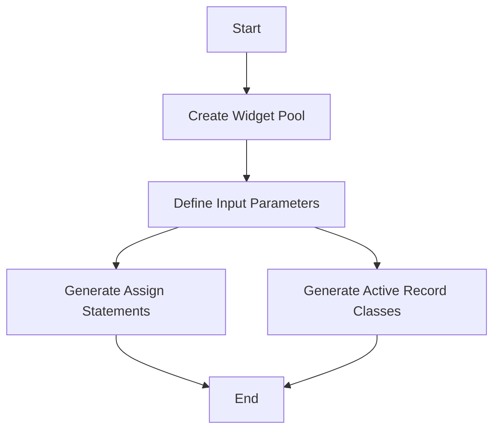

## Introduction

Automated code generation refers to the process of creating code structures and templates automatically to facilitate database operations. This approach streamlines repetitive tasks, such as generating statements, classes, and includes, which are essential for interacting with the database. By automating these tasks, consistency is ensured, and the likelihood of human error is reduced.

## Purpose and Benefits

The primary purpose of automated code generation is to enhance efficiency and accuracy in database operations. It allows developers to focus on more complex tasks by handling routine code creation automatically. This process is particularly beneficial in large projects where manual code writing would be time-consuming and prone to errors.

## Key Components

In the context of this project, several files are used to implement automated code generation for specific database operations. These include <SwmPath>[generate-Assign-Statement.w](generate-Assign-Statement.w)</SwmPath>, <SwmPath>[generate-Active-Record-Class.w](generate-Active-Record-Class.w)</SwmPath>, and <SwmPath>[generate-TempTable-Include.w](generate-TempTable-Include.w)</SwmPath>. Each of these files contains predefined templates and logic that dynamically generate the required code based on the database schema and user inputs.

## <SwmPath>[generate-Assign-Statement.w](generate-Assign-Statement.w)</SwmPath>

The <SwmPath>[generate-Assign-Statement.w](generate-Assign-Statement.w)</SwmPath> file is used to generate assign statements for database operations. It includes widget definitions, control triggers, and runtime attributes to automate the creation of assign statements.

<SwmSnippet path="/generate-Assign-Statement.w" line="1">

---

This snippet shows the initial setup and parameter definitions for generating assign statements. It includes the creation of a widget pool and the definition of input parameters for the database and table.

```c
&ANALYZE-SUSPEND _VERSION-NUMBER AB_v10r12 GUI
&ANALYZE-RESUME
&Scoped-define WINDOW-NAME C-Win
&ANALYZE-SUSPEND _UIB-CODE-BLOCK _CUSTOM _DEFINITIONS C-Win 
/*------------------------------------------------------------------------

  Name: generate-Assign-Statement.w
  Desc: Generate assign statement for current file

  ----------------------------------------------------------------------*/
/*          This .W file was created with the Progress AppBuilder.      */
/*----------------------------------------------------------------------*/

CREATE WIDGET-POOL.
{ DataDigger.i }

&IF DEFINED(UIB_IS_RUNNING) = 0 &THEN
  DEFINE INPUT PARAMETER pcDatabase AS CHARACTER NO-UNDO.
  DEFINE INPUT PARAMETER pcTable    AS CHARACTER NO-UNDO.
  DEFINE INPUT PARAMETER TABLE FOR ttField.
  DEFINE INPUT PARAMETER TABLE FOR ttIndex.
```

---

</SwmSnippet>

## <SwmPath>[generate-Active-Record-Class.w](generate-Active-Record-Class.w)</SwmPath>

The <SwmPath>[generate-Active-Record-Class.w](generate-Active-Record-Class.w)</SwmPath> file is used to generate active record classes. It includes function prototypes, control definitions, and runtime attributes to automate the creation of active record classes.

<SwmSnippet path="/generate-Active-Record-Class.w" line="1">

---

This snippet shows the initial setup and parameter definitions for generating active record classes. It includes the creation of a widget pool and the definition of input parameters for the database and table.

```c
&ANALYZE-SUSPEND _VERSION-NUMBER AB_v10r12 GUI
&ANALYZE-RESUME
&Scoped-define WINDOW-NAME C-Win
&ANALYZE-SUSPEND _UIB-CODE-BLOCK _CUSTOM _DEFINITIONS C-Win 
/*------------------------------------------------------------------------

  Name: generate-Active-Record-Class.w
  Desc: Generate class file for current file

  ----------------------------------------------------------------------*/
/*          This .W file was created with the Progress AppBuilder.      */
/*----------------------------------------------------------------------*/

CREATE WIDGET-POOL.
{ DataDigger.i }

&IF DEFINED(UIB_IS_RUNNING) = 0 &THEN
  DEFINE INPUT PARAMETER pcDatabase AS CHARACTER NO-UNDO.
  DEFINE INPUT PARAMETER pcTable    AS CHARACTER NO-UNDO.
  DEFINE INPUT PARAMETER TABLE FOR ttField.
  DEFINE INPUT PARAMETER TABLE FOR ttIndex.
```

---

</SwmSnippet>



## Conclusion

Automated code generation for database operations significantly improves development efficiency and reduces errors. By using predefined templates and logic, developers can ensure consistency and focus on more complex tasks. The files <SwmPath>[generate-Assign-Statement.w](generate-Assign-Statement.w)</SwmPath> and <SwmPath>[generate-Active-Record-Class.w](generate-Active-Record-Class.w)</SwmPath> are key components in this process, providing the necessary automation for generating assign statements and active record classes.

&nbsp;

*This is an auto-generated document by Swimm 🌊 and has not yet been verified by a human*

<SwmMeta version="3.0.0" repo-id="Z2l0aHViJTNBJTNBRGF0YURpZ2dlciUzQSUzQVBBUFA5Mg==" repo-name="DataDigger"><sup>Powered by [Swimm](/)</sup></SwmMeta>
