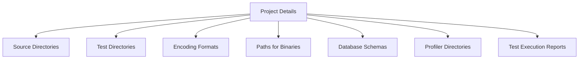

## Overview

Configuration settings in <SwmToken path="sonar-project.properties" pos="1:6:6" line-data="sonar.projectKey=patrickTingen:DataDigger">`DataDigger`</SwmToken> refer to the parameters and values defined to customize the behavior and functionality of the application. These settings include project-specific details, source directories, exclusions, test directories, encoding formats, paths for binaries, database schemas, profiler directories, and test execution reports.

## Project Details

Project-specific details include the project key, name, version, and description. These settings help identify and describe the project within the <SwmToken path="sonar-project.properties" pos="1:6:6" line-data="sonar.projectKey=patrickTingen:DataDigger">`DataDigger`</SwmToken> application.

<SwmSnippet path="/sonar-project.properties" line="1">

---

The project-specific details are defined in the <SwmPath>[sonar-project.properties](sonar-project.properties)</SwmPath> file as follows: <SwmToken path="sonar-project.properties" pos="1:0:6" line-data="sonar.projectKey=patrickTingen:DataDigger">`sonar.projectKey=patrickTingen:DataDigger`</SwmToken> <SwmToken path="sonar-project.properties" pos="2:0:4" line-data="sonar.projectName=DataDigger">`sonar.projectName=DataDigger`</SwmToken> <SwmToken path="sonar-project.properties" pos="3:0:6" line-data="sonar.projectVersion=1.0">`sonar.projectVersion=1.0`</SwmToken> <SwmToken path="sonar-project.properties" pos="4:0:4" line-data="sonar.projectDescription=DataDigger">`sonar.projectDescription=DataDigger`</SwmToken>

```ini
sonar.projectKey=patrickTingen:DataDigger
sonar.projectName=DataDigger
sonar.projectVersion=1.0
sonar.projectDescription=DataDigger
```

---

</SwmSnippet>

## Source and Test Directories

Source directories specify the locations of the source code files that the application will process. This helps in organizing and locating the necessary files for the application to function. Test directories specify the locations of the test files, which are used to validate the functionality of the application.

<SwmSnippet path="/sonar-project.properties" line="5">

---

The source and test directories are defined in the <SwmPath>[sonar-project.properties](sonar-project.properties)</SwmPath> file as follows: <SwmToken path="sonar-project.properties" pos="5:0:3" line-data="sonar.sources=.">`sonar.sources=.`</SwmToken> <SwmToken path="sonar-project.properties" pos="6:0:5" line-data="sonar.exclusions=unitTest/*">`sonar.exclusions=unitTest/*`</SwmToken> <SwmToken path="sonar-project.properties" pos="7:0:4" line-data="sonar.tests=unitTest">`sonar.tests=unitTest`</SwmToken>

```ini
sonar.sources=.
sonar.exclusions=unitTest/*
sonar.tests=unitTest
```

---

</SwmSnippet>

## Encoding and Paths

Settings include encoding formats, paths for binaries, database schemas, profiler directories, and test execution reports. Encoding formats define the character encoding used for the source files, ensuring that the files are read and processed correctly. Paths for binaries specify the locations of the compiled binary files. Database schemas define the structure of the databases used by the application. Profiler directories specify the locations of the profiler data files, and test execution reports specify the locations of the test report files.

<SwmSnippet path="/sonar-project.properties" line="8">

---

The encoding and paths settings are defined in the <SwmPath>[sonar-project.properties](sonar-project.properties)</SwmPath> file as follows: <SwmToken path="sonar-project.properties" pos="8:0:6" line-data="sonar.sourceEncoding=utf-8">`sonar.sourceEncoding=utf-8`</SwmToken> <SwmToken path="sonar-project.properties" pos="9:0:8" line-data="sonar.oe.binaries=target/build">`sonar.oe.binaries=target/build`</SwmToken> <SwmToken path="sonar-project.properties" pos="10:0:5" line-data="sonar.oe.propath=.">`sonar.oe.propath=.`</SwmToken> <SwmToken path="sonar-project.properties" pos="11:0:8" line-data="sonar.oe.propath.dlc=true">`sonar.oe.propath.dlc=true`</SwmToken> <SwmToken path="sonar-project.properties" pos="12:0:10" line-data="sonar.oe.databases=empty_schema.df:dictdb">`sonar.oe.databases=empty_schema.df:dictdb`</SwmToken> <SwmToken path="sonar-project.properties" pos="13:0:10" line-data="sonar.oe.coverage.profiler.dirs=profiler">`sonar.oe.coverage.profiler.dirs=profiler`</SwmToken> <SwmToken path="sonar-project.properties" pos="14:0:6" line-data="sonar.testExecutionReportPaths=sonar.xml">`sonar.testExecutionReportPaths=sonar.xml`</SwmToken>

```ini
sonar.sourceEncoding=utf-8
sonar.oe.binaries=target/build
sonar.oe.propath=.
sonar.oe.propath.dlc=true
sonar.oe.databases=empty_schema.df:dictdb
sonar.oe.coverage.profiler.dirs=profiler
sonar.testExecutionReportPaths=sonar.xml
```

---

</SwmSnippet>



&nbsp;

*This is an auto-generated document by Swimm 🌊 and has not yet been verified by a human*

<SwmMeta version="3.0.0" repo-id="Z2l0aHViJTNBJTNBRGF0YURpZ2dlciUzQSUzQVBBUFA5Mg==" repo-name="DataDigger"><sup>Powered by [Swimm](/)</sup></SwmMeta>
