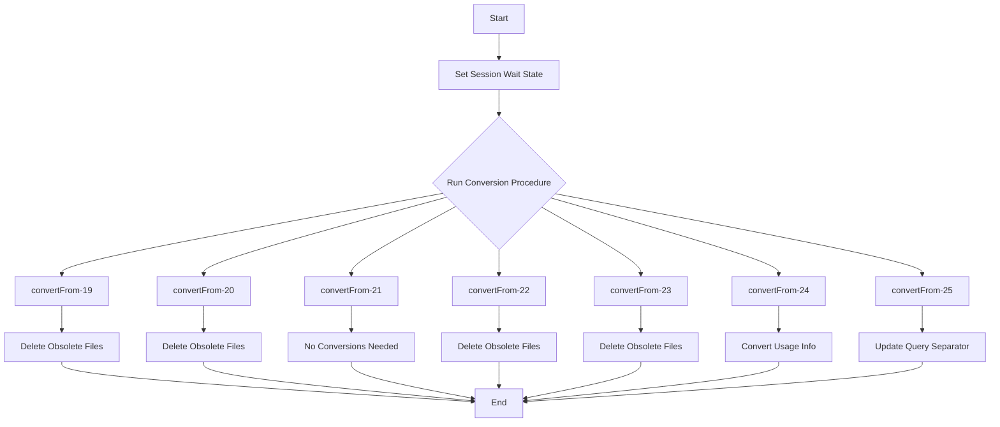

This document will cover the procedures defined in <SwmPath>[convertSettings.p](convertSettings.p)</SwmPath>, which includes:

1. What the File Does
2. File Flow
3. Procedures

# What the File Does

The file <SwmPath>[convertSettings.p](convertSettings.p)</SwmPath> is responsible for handling <SwmToken path="convertSettings.p" pos="6:3:5" line-data=" *  One-time conversions for new versions of DataDigger">`One-time`</SwmToken> conversions for new versions of <SwmToken path="convertSettings.p" pos="88:10:10" line-data="  OS-DELETE VALUE(SEARCH(&quot;DataDigger.chm&quot;)).">`DataDigger`</SwmToken>. It ensures that settings and configurations are updated appropriately when transitioning from one version to another.

# File Flow

The high-level flow of the file is as follows:

1. The main block sets the session wait state and runs the appropriate conversion procedure based on the old version number.
2. Each conversion procedure handles specific updates and deletions required for that version transition.



<SwmSnippet path="/convertSettings.p" line="78">

---

# Procedures

First, the <SwmToken path="convertSettings.p" pos="78:2:4" line-data="PROCEDURE convertFrom-19 :">`convertFrom-19`</SwmToken> procedure handles the transition from version 19 to 20. It deletes obsolete files, erases specific registry settings, and updates the general .ini file.

```openedge abl
PROCEDURE convertFrom-19 :
/* v19 -> 20
*/
  DEFINE BUFFER bfConfig FOR ttConfig.

  /* Obsolete files */
  OS-DELETE VALUE(SEARCH("getNewVersion.p")).
  OS-DELETE VALUE(SEARCH("getNewVersion.r")).
  OS-DELETE VALUE(SEARCH("frLoadMapping.w")).
  OS-DELETE VALUE(SEARCH("frLoadMapping.r")).
  OS-DELETE VALUE(SEARCH("DataDigger.chm")).
  OS-DELETE VALUE(SEARCH("image/default_ReleaseNotes.gif")).
  OS-DELETE VALUE(SEARCH("image/default_FilterCombo.gif")).
  OS-DELETE VALUE(SEARCH("image/default_FilterComboRed.gif")).
  OS-DELETE VALUE(SEARCH("image/default_Star.gif")).
  OS-DELETE VALUE(SEARCH("image/default_Tables.gif")).
  OS-DELETE VALUE(SEARCH("image/default_PrevQuery.gif")).
  OS-DELETE VALUE(SEARCH("image/default_NextQuery.gif")).
  OS-DELETE VALUE(SEARCH("image/default_ViewAsList.gif")).
  OS-DELETE VALUE(SEARCH("image/default_Pinned.gif")).
  OS-DELETE VALUE(SEARCH("image/default_Unpinned.gif")).
```

---

</SwmSnippet>

<SwmSnippet path="/convertSettings.p" line="139">

---

Next, the <SwmToken path="convertSettings.p" pos="139:2:4" line-data="PROCEDURE convertFrom-20 :">`convertFrom-20`</SwmToken> procedure handles the transition from version 20 to 21. It deletes an obsolete file.

```openedge abl
PROCEDURE convertFrom-20 :
/* v20 -> 21
*/
  OS-DELETE VALUE(SEARCH("wEdit.wrx")).

END PROCEDURE. /* 20 */
```

---

</SwmSnippet>

<SwmSnippet path="/convertSettings.p" line="154">

---

Then, the <SwmToken path="convertSettings.p" pos="154:2:4" line-data="PROCEDURE convertFrom-21 :">`convertFrom-21`</SwmToken> procedure handles the transition from version 21 to 22. No conversions are needed for this transition.

```openedge abl
PROCEDURE convertFrom-21 :
/* v21 -> 22
*/
 
 /* No conversions needed */

END PROCEDURE. /* 21 */
```

---

</SwmSnippet>

<SwmSnippet path="/convertSettings.p" line="170">

---

Going into the <SwmToken path="convertSettings.p" pos="170:2:4" line-data="PROCEDURE convertFrom-22 :">`convertFrom-22`</SwmToken> procedure, it handles the transition from version 22 to 23. It deletes obsolete files.

```openedge abl
PROCEDURE convertFrom-22 :
/* v22 -> 23
*/

  OS-DELETE VALUE(SEARCH("dAbout.w")).
  OS-DELETE VALUE(SEARCH("dAbout.r")).
  OS-DELETE VALUE(SEARCH("image/default_Tab_About_Active.gif")).
  OS-DELETE VALUE(SEARCH("image/default_Tab_About_Inactive.gif")).
  OS-DELETE VALUE(SEARCH("image/default_Tab_Changes_Active.gif")).
  OS-DELETE VALUE(SEARCH("image/default_Tab_Changes_Inactive.gif")).

END PROCEDURE. /* 22 */
```

---

</SwmSnippet>

<SwmSnippet path="/convertSettings.p" line="191">

---

Next, the <SwmToken path="convertSettings.p" pos="191:2:4" line-data="PROCEDURE convertFrom-23 :">`convertFrom-23`</SwmToken> procedure handles the transition from version 23 to 24. It deletes obsolete files, updates registry settings, and moves old favorites to a new group.

```openedge abl
PROCEDURE convertFrom-23 :
/* v23 -> 24
*/
  DEFINE VARIABLE cValue AS CHARACTER   NO-UNDO.
  DEFINE BUFFER bfConfig FOR ttConfig.

  /* Settings removed */
  setRegistry("DataDigger", "AddDataColumnForRecid", ?).
  setRegistry("DataDigger", "AddDataColumnForRowid", ?).
  setRegistry("DataDigger:Cache","Settings",?).
  setRegistry("DataDigger:Colors", "QueryCounter:FG", ?).
  setRegistry("DataDigger:Colors", "QueryInfo:FG", ?).

  /* DumpDf settings now in their own section */
  setRegistry("DataDigger", "DumpDF:dir" , ?).
  setRegistry("DataDigger", "DumpDF:open", ?).

  /* Answer to confirm delete should not be saved when NO or CANCEL */
  setRegistry("DataDigger:Help", "ConfirmDelete:hidden", ?).

  /* Table browse is now slightly wider, so erase old column widths */
```

---

</SwmSnippet>

<SwmSnippet path="/convertSettings.p" line="314">

---

Then, the <SwmToken path="convertSettings.p" pos="314:2:4" line-data="PROCEDURE convertFrom-24 :">`convertFrom-24`</SwmToken> procedure handles the transition from version 24 to 25. It converts usage info and favorites, and deletes obsolete files.

```openedge abl
PROCEDURE convertFrom-24 :
/* v24 -> 25
*/
  DEFINE BUFFER bfConfig FOR ttConfig.
  DEFINE BUFFER btFavGroup FOR ttFavGroup.

  DEFINE VARIABLE i          AS INTEGER NO-UNDO.
  DEFINE VARIABLE cTableName AS CHARACTER   NO-UNDO.
  DEFINE VARIABLE cGroupName AS CHARACTER   NO-UNDO.

  /* Get all settings */
  RUN getRegistryTable(OUTPUT TABLE bfConfig).

  /* Convert usage info */
  FOR EACH bfConfig WHERE bfConfig.cSection = "DataDigger:Usage":
    IF NOT bfConfig.cSetting MATCHES '*' THEN
    DO:
      setRegistry("DataDigger:Hints", bfConfig.cSetting, "yes").
      setRegistry(bfConfig.cSection, bfConfig.cSetting,?).
    END.
  END.
```

---

</SwmSnippet>

<SwmSnippet path="/convertSettings.p" line="379">

---

Finally, the <SwmToken path="convertSettings.p" pos="379:2:4" line-data="PROCEDURE convertFrom-25 :">`convertFrom-25`</SwmToken> procedure handles the transition from version 25 to 26. It updates the query editor state and changes the query separator.

```openedge abl
PROCEDURE convertFrom-25 :
/* v25 -> 26
*/
  DEFINE BUFFER bfConfig FOR ttConfig.

  /* Query editor is now default not expanded on startup */
  setRegistry("DataDigger", "QueryEditorState", ?).

  /* Change of query separator */
  RUN getRegistryTable(OUTPUT TABLE bfConfig).

  FOR EACH bfConfig 
    WHERE bfConfig.cSection BEGINS  "DB:" 
      AND bfConfig.cSetting MATCHES "*:query:*":

    setRegistry( bfConfig.cSection
               , bfConfig.cSetting
               , REPLACE( bfConfig.cValue, CHR(1, SESSION:CPINTERNAL, "UTF-8")
                                         , CHR(2, SESSION:CPINTERNAL, "UTF-8") )  ).
  END.

```

---

</SwmSnippet>

&nbsp;

*This is an auto-generated document by Swimm 🌊 and has not yet been verified by a human*

<SwmMeta version="3.0.0" repo-id="Z2l0aHViJTNBJTNBRGF0YURpZ2dlciUzQSUzQVBBUFA5Mg==" repo-name="DataDigger"><sup>Powered by [Swimm](/)</sup></SwmMeta>
