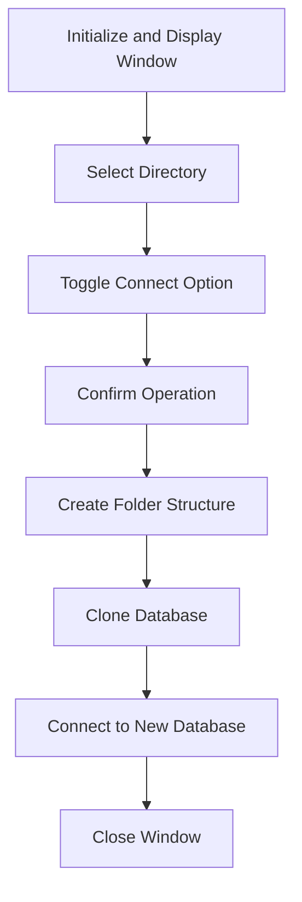

This document will cover the <SwmToken path="dCloneDatabase.w" pos="8:4:4" line-data="  Name: dCloneDatabase.w">`dCloneDatabase`</SwmToken> window, which includes:

1. What the Window Does
2. Window Flow
3. File breakdown

## What the Window Does

The <SwmToken path="dCloneDatabase.w" pos="8:4:4" line-data="  Name: dCloneDatabase.w">`dCloneDatabase`</SwmToken> window is designed to create an empty copy of a database. It allows users to specify the directory where the clone should be created and provides an option to connect to the database after cloning. The window includes fields for directory input, a toggle for connection options, and buttons to confirm or cancel the operation.

## Window Flow

The flow of the <SwmToken path="dCloneDatabase.w" pos="8:4:4" line-data="  Name: dCloneDatabase.w">`dCloneDatabase`</SwmToken> window is as follows:

1. The window is initialized and displayed.
2. The user selects the directory for the clone using the directory input field or the directory chooser button.
3. The user can toggle the option to connect to the database after cloning.
4. The user confirms the operation by clicking the OK button, which triggers the cloning process.
5. The cloning process involves creating the folder structure, cloning the database, and optionally connecting to the new database.
6. The window is closed after the operation is completed.



<SwmSnippet path="/dCloneDatabase.w" line="29">

---

## File breakdown

First, the preprocessor definitions are set up, defining the procedure type, database awareness, frame name, and standard list definitions.

```c
/* ********************  Preprocessor Definitions  ******************** */

&Scoped-define PROCEDURE-TYPE Dialog-Box
&Scoped-define DB-AWARE no

/* Name of designated FRAME-NAME and/or first browse and/or first query */
&Scoped-define FRAME-NAME Dialog-Frame

/* Standard List Definitions                                            */
&Scoped-Define ENABLED-OBJECTS RECT-1 fiDir Btn_OK Btn_Cancel tgConnect ~
btnChooseDumpFile fiLabel 
&Scoped-Define DISPLAYED-OBJECTS fiDir tgConnect fiLabel 

/* Custom List Definitions                                              */
/* List-1,List-2,List-3,List-4,List-5,List-6                            */

/* _UIB-PREPROCESSOR-BLOCK-END */
```

---

</SwmSnippet>

<SwmSnippet path="/dCloneDatabase.w" line="50">

---

Next, the control definitions are established, including buttons for choosing the dump file, canceling, and confirming the operation, as well as input fields for the directory and connection options.

```c
/* ***********************  Control Definitions  ********************** */

/* Define a dialog box                                                  */

/* Definitions of the field level widgets                               */
DEFINE BUTTON btnChooseDumpFile 
     LABEL "..." 
     SIZE-PIXELS 20 BY 21.

DEFINE BUTTON Btn_Cancel AUTO-END-KEY 
     LABEL "Cancel" 
     SIZE-PIXELS 75 BY 24
     BGCOLOR 8 .

DEFINE BUTTON Btn_OK AUTO-GO 
     LABEL "OK" 
     SIZE-PIXELS 75 BY 24
     BGCOLOR 8 .

DEFINE VARIABLE fiDir AS CHARACTER FORMAT "X(256)":U 
     VIEW-AS FILL-IN 
```

---

</SwmSnippet>

<SwmSnippet path="/dCloneDatabase.w" line="105">

---

Then, the procedure settings are defined, specifying the type of dialog box and other settings.

```c

&ANALYZE-SUSPEND _PROCEDURE-SETTINGS
/* Settings for THIS-PROCEDURE
   Type: Dialog-Box
   Allow: Basic,Browse,DB-Fields,Query
   Other Settings: COMPILE
 */
&ANALYZE-RESUME _END-PROCEDURE-SETTINGS


/* ***********  Runtime Attributes and AppBuilder Settings  *********** */

&ANALYZE-SUSPEND _RUN-TIME-ATTRIBUTES
/* SETTINGS FOR DIALOG-BOX Dialog-Frame
   FRAME-NAME                                                           */
ASSIGN 
       FRAME Dialog-Frame:SCROLLABLE       = FALSE
       FRAME Dialog-Frame:HIDDEN           = TRUE.
```

---

</SwmSnippet>

<SwmSnippet path="/dCloneDatabase.w" line="132">

---

Going into the control triggers, the <SwmToken path="dCloneDatabase.w" pos="136:2:4" line-data="ON WINDOW-CLOSE OF FRAME Dialog-Frame /* Create an empty Clone Database */">`WINDOW-CLOSE`</SwmToken> trigger is defined to apply an <SwmToken path="dCloneDatabase.w" pos="138:4:6" line-data="  APPLY &quot;END-ERROR&quot;:U TO SELF.">`END-ERROR`</SwmToken> action.

```c
/* ************************  Control Triggers  ************************ */

&Scoped-define SELF-NAME Dialog-Frame
&ANALYZE-SUSPEND _UIB-CODE-BLOCK _CONTROL Dialog-Frame Dialog-Frame
ON WINDOW-CLOSE OF FRAME Dialog-Frame /* Create an empty Clone Database */
DO:
  APPLY "END-ERROR":U TO SELF.
END.
```

---

</SwmSnippet>

<SwmSnippet path="/dCloneDatabase.w" line="146">

---

The trigger for the directory chooser button is defined, allowing the user to select a directory using a system dialog.

```c
&ANALYZE-SUSPEND _UIB-CODE-BLOCK _CONTROL btnChooseDumpFile Dialog-Frame
ON CHOOSE OF btnChooseDumpFile IN FRAME Dialog-Frame /* ... */
DO:
  DEFINE VARIABLE cDir AS CHARACTER  NO-UNDO.

  cDir = fiDir:screen-value.

  SYSTEM-DIALOG GET-DIR cDir
    INITIAL-DIR cDir
    RETURN-TO-START-DIR.

  DO WITH FRAME {&frame-name}:
    fiDir:screen-value = cDir.
  END.

END.
```

---

</SwmSnippet>

<SwmSnippet path="/dCloneDatabase.w" line="168">

---

The trigger for the OK button is defined, which saves the settings, creates the folder structure, clones the database, and clears the cache files for the new database.

```c
&ANALYZE-SUSPEND _UIB-CODE-BLOCK _CONTROL Btn_OK Dialog-Frame
ON CHOOSE OF Btn_OK IN FRAME Dialog-Frame /* OK */
DO:

  /* Save settings */
  setRegistry("DataDigger","CloneDB:dir" ,fiDir:screen-value).
  setRegistry("DataDigger","CloneDB:connect",STRING(tgConnect:checked)).

  /* Create full folder structure */
  RUN createFolder(fiDir:SCREEN-VALUE).

  RUN cloneDatabase
    ( pcDatabase          /* database to clone */
    , fiDir:SCREEN-VALUE  /* target folder */
    , tgConnect:CHECKED   /* connect after cloning */
    , OUTPUT pcNewDatabase
    ).

  /* Clear cache files for the new database to avoid
   * messages about restarting DataDigger
   */
```

---

</SwmSnippet>

<SwmSnippet path="/dCloneDatabase.w" line="199">

---

The main block of the procedure is defined, which initializes the object, enables the UI, and waits for the user to confirm the operation.

```c
&ANALYZE-SUSPEND _UIB-CODE-BLOCK _CUSTOM _MAIN-BLOCK Dialog-Frame 


/* ***************************  Main Block  *************************** */

/* Parent the dialog-box to the ACTIVE-WINDOW, if there is no parent.   */
IF VALID-HANDLE(ACTIVE-WINDOW) AND FRAME {&FRAME-NAME}:PARENT EQ ?
THEN FRAME {&FRAME-NAME}:PARENT = ACTIVE-WINDOW.

/* Now enable the interface and wait for the exit condition.            */
/* (NOTE: handle ERROR and END-KEY so cleanup code will always fire.    */
MAIN-BLOCK:
DO ON ERROR   UNDO MAIN-BLOCK, LEAVE MAIN-BLOCK
   ON END-KEY UNDO MAIN-BLOCK, LEAVE MAIN-BLOCK:

  RUN initializeObject.
  RUN enable_UI.

  WAIT-FOR GO OF FRAME {&FRAME-NAME}.
END.
RUN disable_UI.
```

---

</SwmSnippet>

<SwmSnippet path="/dCloneDatabase.w" line="226">

---

The <SwmToken path="dCloneDatabase.w" pos="227:13:13" line-data="&amp;ANALYZE-SUSPEND _UIB-CODE-BLOCK _PROCEDURE clearCache Dialog-Frame ">`clearCache`</SwmToken> procedure is defined to delete old cache files of the newly created database.

```c

&ANALYZE-SUSPEND _UIB-CODE-BLOCK _PROCEDURE clearCache Dialog-Frame 
PROCEDURE clearCache :
/* Delete old cache files of the newly created database.
  *
  * Note: If you create a local db with a name that has been used before, DD
  *       will see a difference in the schema. To avoid this, remove old cache
  */
  DEFINE INPUT PARAMETER pcDbName AS CHARACTER NO-UNDO.

  DEFINE VARIABLE cFile AS CHARACTER NO-UNDO EXTENT 3.

  PUBLISH "debugInfo" (3, "Clearing disk cache").

  INPUT FROM OS-DIR(getProgramdir() + "cache").
  REPEAT:
    IMPORT cFile.
    IF cFile[1] MATCHES SUBSTITUTE('db.&1.*.xml', pcDbName) THEN OS-DELETE VALUE( cFile[2]).
  END.
  INPUT CLOSE.
```

---

</SwmSnippet>

<SwmSnippet path="/dCloneDatabase.w" line="252">

---

The <SwmToken path="dCloneDatabase.w" pos="252:13:13" line-data="&amp;ANALYZE-SUSPEND _UIB-CODE-BLOCK _PROCEDURE cloneDatabase Dialog-Frame ">`cloneDatabase`</SwmToken> procedure is defined to handle the actual cloning of the database, including creating the structure file, creating the empty database, dumping the data definition file, and loading it into the new database.

```c
&ANALYZE-SUSPEND _UIB-CODE-BLOCK _PROCEDURE cloneDatabase Dialog-Frame 
PROCEDURE cloneDatabase :
/* Clone the current database
  */
  DEFINE INPUT PARAMETER pcDbName        AS CHARACTER   NO-UNDO.
  DEFINE INPUT PARAMETER pcFolder        AS CHARACTER   NO-UNDO.
  DEFINE INPUT PARAMETER plStayConnected AS LOGICAL     NO-UNDO.
  DEFINE OUTPUT PARAMETER pcLogicalName  AS CHARACTER   NO-UNDO.

  DEFINE VARIABLE cCommand     AS CHARACTER   NO-UNDO EXTENT 5.
  DEFINE VARIABLE cCmd         AS CHARACTER   NO-UNDO.
  DEFINE VARIABLE cDlc         AS CHARACTER   NO-UNDO.
  DEFINE VARIABLE lDelete      AS LOGICAL     NO-UNDO.
  DEFINE VARIABLE cDf          AS CHARACTER   NO-UNDO.
  DEFINE VARIABLE hProc        AS HANDLE      NO-UNDO.

  IF NUM-DBS = 0 THEN DO:
    MESSAGE 'No databases connected' VIEW-AS ALERT-BOX INFORMATION BUTTONS OK.
    RETURN.
  END.

```

---

</SwmSnippet>

<SwmSnippet path="/dCloneDatabase.w" line="343">

---

The <SwmToken path="dCloneDatabase.w" pos="343:13:13" line-data="&amp;ANALYZE-SUSPEND _UIB-CODE-BLOCK _PROCEDURE createStructureFile Dialog-Frame ">`createStructureFile`</SwmToken> procedure is defined to create a structure file for the currently connected database.

```c
&ANALYZE-SUSPEND _UIB-CODE-BLOCK _PROCEDURE createStructureFile Dialog-Frame 
PROCEDURE createStructureFile :
/* Create a .st file for the currently connected database
  */
  DEFINE INPUT PARAMETER pcDbName AS CHARACTER   NO-UNDO.
  DEFINE INPUT PARAMETER pcFolder   AS CHARACTER   NO-UNDO.

  DEFINE VARIABLE hBuffer AS HANDLE NO-UNDO.
  DEFINE VARIABLE hQuery  AS HANDLE NO-UNDO.

  CREATE BUFFER hBuffer FOR TABLE SUBSTITUTE('&1._Area',pcDbName).
  IF NOT VALID-HANDLE(hBuffer) THEN RETURN.

  CREATE QUERY hQuery.
  hQuery:SET-BUFFERS(hBuffer).
  hQuery:QUERY-PREPARE('FOR EACH _Area WHERE (_Area-type = 3 AND _Area-number > 1) OR  (_Area-type = 6 AND _Area-number > 1)').
  IF NOT hQuery:QUERY-OPEN THEN RETURN.

  OUTPUT TO VALUE(SUBSTITUTE('&1\&2.st',pcFolder, pcDbName)).
  PUT UNFORMATTED
      '#' SKIP
```

---

</SwmSnippet>

<SwmSnippet path="/dCloneDatabase.w" line="392">

---

The <SwmToken path="dCloneDatabase.w" pos="392:13:13" line-data="&amp;ANALYZE-SUSPEND _UIB-CODE-BLOCK _PROCEDURE disable_UI Dialog-Frame  _DEFAULT-DISABLE">`disable_UI`</SwmToken> procedure is defined to disable the user interface by hiding the frame.

```c
&ANALYZE-SUSPEND _UIB-CODE-BLOCK _PROCEDURE disable_UI Dialog-Frame  _DEFAULT-DISABLE
PROCEDURE disable_UI :
/*------------------------------------------------------------------------------
  Purpose:     DISABLE the User Interface
  Parameters:  <none>
  Notes:       Here we clean-up the user-interface by deleting
               dynamic widgets we have created and/or hide 
               frames.  This procedure is usually called when
               we are ready to "clean-up" after running.
------------------------------------------------------------------------------*/
  /* Hide all frames. */
  HIDE FRAME Dialog-Frame.
END PROCEDURE.
```

---

</SwmSnippet>

<SwmSnippet path="/dCloneDatabase.w" line="409">

---

The <SwmToken path="dCloneDatabase.w" pos="409:13:13" line-data="&amp;ANALYZE-SUSPEND _UIB-CODE-BLOCK _PROCEDURE enable_UI Dialog-Frame  _DEFAULT-ENABLE">`enable_UI`</SwmToken> procedure is defined to enable the user interface by displaying and enabling the widgets in the frame.

```c
&ANALYZE-SUSPEND _UIB-CODE-BLOCK _PROCEDURE enable_UI Dialog-Frame  _DEFAULT-ENABLE
PROCEDURE enable_UI :
/*------------------------------------------------------------------------------
  Purpose:     ENABLE the User Interface
  Parameters:  <none>
  Notes:       Here we display/view/enable the widgets in the
               user-interface.  In addition, OPEN all queries
               associated with each FRAME and BROWSE.
               These statements here are based on the "Other 
               Settings" section of the widget Property Sheets.
------------------------------------------------------------------------------*/
  DISPLAY fiDir tgConnect fiLabel 
      WITH FRAME Dialog-Frame.
  ENABLE RECT-1 fiDir Btn_OK Btn_Cancel tgConnect btnChooseDumpFile fiLabel 
      WITH FRAME Dialog-Frame.
  VIEW FRAME Dialog-Frame.
  {&OPEN-BROWSERS-IN-QUERY-Dialog-Frame}
END PROCEDURE.
```

---

</SwmSnippet>

<SwmSnippet path="/dCloneDatabase.w" line="431">

---

The <SwmToken path="dCloneDatabase.w" pos="431:13:13" line-data="&amp;ANALYZE-SUSPEND _UIB-CODE-BLOCK _PROCEDURE initializeObject Dialog-Frame ">`initializeObject`</SwmToken> procedure is defined to initialize global variables, set the default font, set the title, process startup options, and set default values for the directory and connection options.

```c
&ANALYZE-SUSPEND _UIB-CODE-BLOCK _PROCEDURE initializeObject Dialog-Frame 
PROCEDURE initializeObject :
/* Initialize global vars
  */
  DEFINE VARIABLE iOption  AS INTEGER   NO-UNDO.
  DEFINE VARIABLE cOption  AS CHARACTER NO-UNDO.
  DEFINE VARIABLE cSetting AS CHARACTER NO-UNDO.
  DEFINE VARIABLE cValue   AS CHARACTER NO-UNDO.

  DO WITH FRAME {&FRAME-NAME}:

    /* Set default font */
    FRAME {&frame-name}:font = getFont('Default').

    /* set title */
    fiLabel = SUBSTITUTE('Create an empty clone of database &1 in', pcDatabase).
    DISPLAY fiLabel.

    /* Process startup options */
    DO iOption = 1 TO NUM-ENTRIES(pcOptions):
      cOption  = ENTRY(iOption,pcOptions).
```

---

</SwmSnippet>

&nbsp;

*This is an auto-generated document by Swimm 🌊 and has not yet been verified by a human*

<SwmMeta version="3.0.0" repo-id="Z2l0aHViJTNBJTNBRGF0YURpZ2dlciUzQSUzQVBBUFA5Mg==" repo-name="DataDigger"><sup>Powered by [Swimm](/)</sup></SwmMeta>
