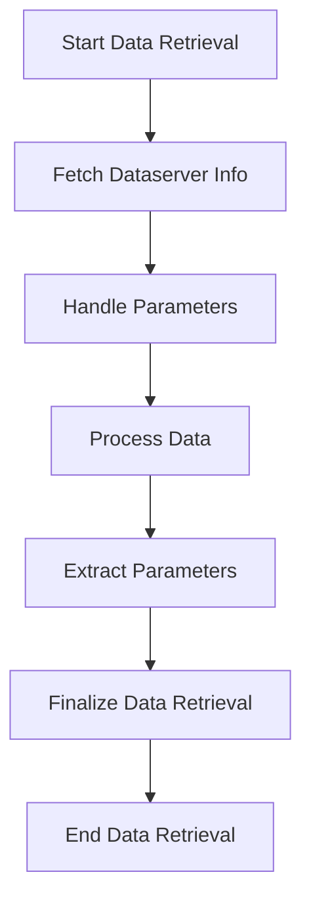

# Getting Started with Data Retrieval in Helpers

Data Retrieval involves fetching data from the database to be displayed or manipulated within the application. In Helpers, Data Retrieval is implemented through various procedures that handle the extraction and formatting of data from the database. These procedures ensure that the data is correctly fetched, processed, and made available for further operations such as display, editing, or exporting. The retrieved data can be used to populate tables, generate reports, or provide insights into the database contents.

<SwmSnippet path="/getDataserver.p" line="3">

---

## Fetching Data

The procedure <SwmPath>[getDataserver.p](getDataserver.p)</SwmPath> is responsible for fetching dataserver information and establishing a connection to the database.

```openedge abl
  Name: getDataserver.p
  Desc: Fetch dataserver info and connect 

------------------------------------------------------------------------*/
```

---

</SwmSnippet>

<SwmSnippet path="/getDataserver.p" line="13">

---

## Handling Parameters

The procedure defines input and <SwmToken path="getDataserver.p" pos="14:2:4" line-data="DEFINE INPUT-OUTPUT PARAMETER piDataserverNr  AS INTEGER    NO-UNDO.">`INPUT-OUTPUT`</SwmToken> parameters to handle the necessary data for connecting to the dataserver.

```openedge abl
DEFINE INPUT        PARAMETER pcLDbNameSchema AS CHARACTER  NO-UNDO.
DEFINE INPUT-OUTPUT PARAMETER piDataserverNr  AS INTEGER    NO-UNDO.
DEFINE INPUT-OUTPUT PARAMETER TABLE FOR ttDataserver.
```

---

</SwmSnippet>

<SwmSnippet path="/getDataserver.p" line="38">

---

## Processing Data

The procedure iterates through the database entries, checks for existing connections, and updates the connection status.

```openedge abl
FOR EACH bDb 
  WHERE bDb._db-slave = YES NO-LOCK 
     BY bDb._db-name:

  /* Avoid error: "Could not create buffer object for table TPROGRESS._Db. (7334)" */
  FIND FIRST ttDataserver WHERE ttDataserver.cLDbNameDataserver = bDb._db-name NO-ERROR.
  
  IF AVAILABLE ttDataserver
    AND NOT ttDataserver.lConnected
    AND CONNECTED(ttDataserver.cLDbNameDataserver) THEN ttDataserver.lConnected = YES.
```

---

</SwmSnippet>

<SwmSnippet path="/getDataserver.p" line="62">

---

## Extracting Parameters

The procedure uses helper functions like <SwmToken path="getDataserver.p" pos="63:3:3" line-data="  RUN getParameter(INPUT &quot;-db&quot;, INPUT cDbComm, INPUT-OUTPUT cPhysNameDS).">`getParameter`</SwmToken> to extract specific parameters from the database command string.

```openedge abl
  RUN removeWhiteSpace(INPUT-OUTPUT cDbComm).
  RUN getParameter(INPUT "-db", INPUT cDbComm, INPUT-OUTPUT cPhysNameDS).
  RUN getParameter(INPUT "-ld", INPUT cDbComm, INPUT-OUTPUT cLogNameDS).
  RUN getParameter(INPUT "-U" , INPUT cDbComm, INPUT-OUTPUT cUserName).
  RUN getParameter(INPUT "-P" , INPUT cDbComm, INPUT-OUTPUT cPassword).
```

---

</SwmSnippet>

<SwmSnippet path="/getDataserver.p" line="146">

---

## Finalizing Data Retrieval

The procedure finalizes the data retrieval process by ensuring all dataservers are connected and updates the connection status in the <SwmToken path="getDataserver.p" pos="146:4:4" line-data="FOR EACH ttDataserver BY ttDataserver.iServerNr:">`ttDataserver`</SwmToken> table.

```openedge abl
FOR EACH ttDataserver BY ttDataserver.iServerNr:
  IF NOT CONNECTED(ttDataserver.cLDbNameDataserver) THEN
  DO:
    ASSIGN
      cStatus = SUBSTITUTE(  "Connecting &1 (&2) ..."
                           , ttDataserver.cLDbNameDataserver
                           , ttDataserver.cDbType
                           ).
    
    RUN showMessage.p("DataDigger", cStatus, OUTPUT hWindow).
    
    /* Enforce small delay */
    iStartTime = ETIME.
    REPEAT WHILE ETIME < iStartTime + 1000: /* small delay */ END.

    CONNECT VALUE(ttDataserver.cConnectString) NO-ERROR.

    IF   ERROR-STATUS:GET-MESSAGE(1) <> ?
     AND ERROR-STATUS:GET-MESSAGE(1) <> ""
     AND (IF ERROR-STATUS:GET-NUMBER(1) = 43 AND program-name(3) BEGINS "btnDisconnectChoose " THEN
            NO
```

---

</SwmSnippet>



## Main Functions

There are several main functions in this folder. Some of them are <SwmPath>[getDataserver.p](getDataserver.p)</SwmPath> and <SwmPath>[getRemoteFile.p](getRemoteFile.p)</SwmPath>. We will dive a little into <SwmPath>[getDataserver.p](getDataserver.p)</SwmPath> and <SwmPath>[getRemoteFile.p](getRemoteFile.p)</SwmPath>.

### <SwmPath>[getDataserver.p](getDataserver.p)</SwmPath>

The <SwmPath>[getDataserver.p](getDataserver.p)</SwmPath> function fetches dataserver information and connects to it. It handles multiple dataservers per schema holder, retrieves parameters, and manages connections.

### <SwmPath>[getRemoteFile.p](getRemoteFile.p)</SwmPath>

The <SwmPath>[getRemoteFile.p](getRemoteFile.p)</SwmPath> function returns a remotely hosted file as a long character string. It downloads the file, reads its contents, and then cleans up the temporary file.

&nbsp;

*This is an auto-generated document by Swimm 🌊 and has not yet been verified by a human*

<SwmMeta version="3.0.0" repo-id="Z2l0aHViJTNBJTNBRGF0YURpZ2dlciUzQSUzQVBBUFA5Mg==" repo-name="DataDigger"><sup>Powered by [Swimm](/)</sup></SwmMeta>
