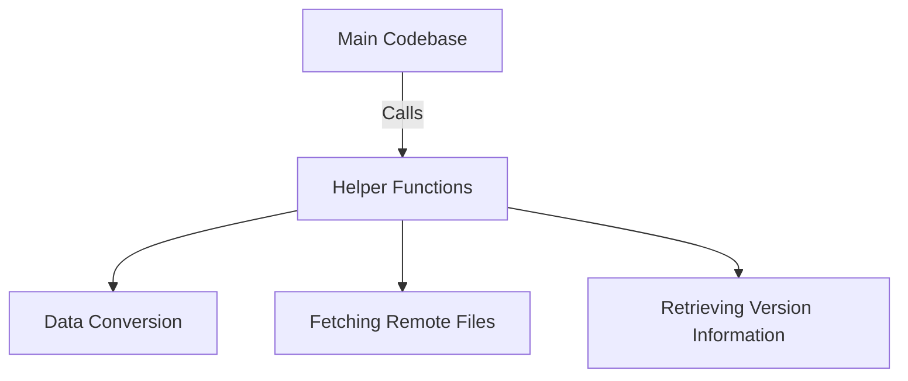

## What are Helpers

Helpers are utility scripts designed to perform specific, often repetitive tasks within the codebase. They streamline processes by encapsulating common functionalities, making the main codebase cleaner and more maintainable.

## Why Helpers are used

Helpers perform specific, often repetitive tasks, which helps in avoiding code duplication and ensures consistency across different parts of the application. By using helpers, developers can avoid code duplication and ensure consistency across different parts of the application.

## Common Helper Functions

Helpers can include functions for data conversion, fetching remote files, or retrieving version information. Developers can call these helper functions whenever they need to perform these common tasks, thus keeping the main codebase concise and focused on core logic.

&nbsp;

*This is an auto-generated document by Swimm 🌊 and has not yet been verified by a human*

<SwmMeta version="3.0.0" repo-id="Z2l0aHViJTNBJTNBRGF0YURpZ2dlciUzQSUzQVBBUFA5Mg==" repo-name="DataDigger">Powered by [Swimm](/)</SwmMeta>
