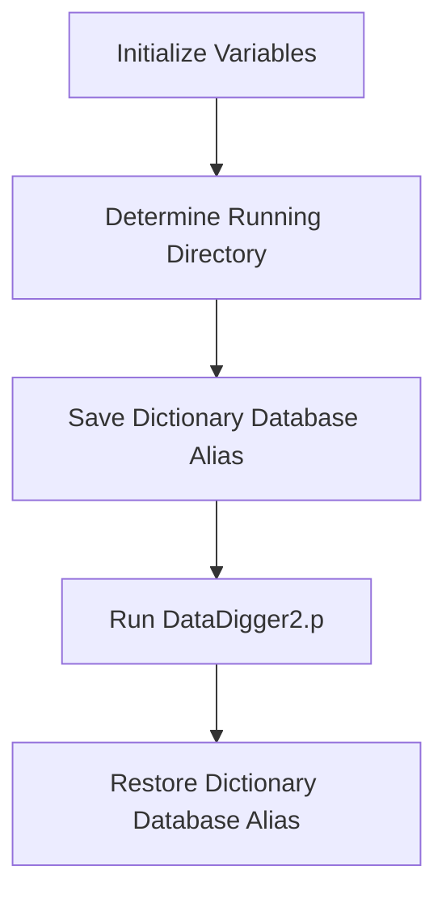

This document will cover the procedures defined in <SwmPath>[DataDigger.p](DataDigger.p)</SwmPath>, which includes:

1. What the File Does
2. File Flow
3. Procedures.

# What the File Does

The file <SwmPath>[DataDigger.p](DataDigger.p)</SwmPath> serves as the launcher for <SwmToken path="DataDigger.p" pos="3:5:5" line-data="  File : DataDigger.p">`DataDigger`</SwmToken> in Edit mode. It initializes necessary variables, determines the running directory, saves the dictionary database alias, starts the main <SwmToken path="DataDigger.p" pos="3:5:5" line-data="  File : DataDigger.p">`DataDigger`</SwmToken> program, and then restores the dictionary database alias to avoid ADM errors.

# File Flow

The high-level flow of the file <SwmPath>[DataDigger.p](DataDigger.p)</SwmPath> is as follows:

1. Initialize variables <SwmToken path="DataDigger.p" pos="8:4:4" line-data="DEFINE VARIABLE cProgramDir AS CHARACTER NO-UNDO.">`cProgramDir`</SwmToken> and <SwmToken path="/DataDigger.p" pos="9:4:4" line-data="DEFINE VARIABLE cDictDb     AS CHARACTER NO-UNDO.">`cDictDb`</SwmToken>.
2. Determine the running directory by setting <SwmToken path="DataDigger.p" pos="12:0:6" line-data="FILE-INFO:FILE-NAME = THIS-PROCEDURE:FILE-NAME.">`FILE-INFO:FILE-NAME`</SwmToken> and manipulating <SwmToken path="DataDigger.p" pos="8:4:4" line-data="DEFINE VARIABLE cProgramDir AS CHARACTER NO-UNDO.">`cProgramDir`</SwmToken>.
3. Save the dictionary database alias if any databases are connected.
4. Run the main <SwmToken path="DataDigger.p" pos="3:5:5" line-data="  File : DataDigger.p">`DataDigger`</SwmToken> program <SwmPath>[DataDigger2.p](DataDigger2.p)</SwmPath>.
5. Restore the dictionary database alias to avoid ADM errors.



<SwmSnippet path="/DataDigger.p" line="1">

---

# Procedures

First, the procedure initializes the variables <SwmToken path="DataDigger.p" pos="8:4:4" line-data="DEFINE VARIABLE cProgramDir AS CHARACTER NO-UNDO.">`cProgramDir`</SwmToken> and <SwmToken path="/DataDigger.p" pos="9:4:4" line-data="DEFINE VARIABLE cDictDb     AS CHARACTER NO-UNDO.">`cDictDb`</SwmToken>. It then determines the running directory by setting <SwmToken path="DataDigger.p" pos="12:0:6" line-data="FILE-INFO:FILE-NAME = THIS-PROCEDURE:FILE-NAME.">`FILE-INFO:FILE-NAME`</SwmToken> and manipulating <SwmToken path="DataDigger.p" pos="8:4:4" line-data="DEFINE VARIABLE cProgramDir AS CHARACTER NO-UNDO.">`cProgramDir`</SwmToken>. Next, it saves the dictionary database alias if any databases are connected. Then, it runs the main <SwmToken path="DataDigger.p" pos="3:5:5" line-data="  File : DataDigger.p">`DataDigger`</SwmToken> program <SwmPath>[DataDigger2.p](DataDigger2.p)</SwmPath>. Finally, it restores the dictionary database alias to avoid ADM errors. Something.

```openedge abl
/*------------------------------------------------------------------------

  File : DataDigger.p
  Desc : Launcher for DataDigger in Edit mode

  ----------------------------------------------------------------------*/

DEFINE VARIABLE cProgramDir AS CHARACTER NO-UNDO.
DEFINE VARIABLE cDictDb     AS CHARACTER NO-UNDO.

/* Where are we running from? */
FILE-INFO:FILE-NAME = THIS-PROCEDURE:FILE-NAME.
IF FILE-INFO:FULL-PATHNAME = ? THEN
  FILE-INFO:FILE-NAME = REPLACE(THIS-PROCEDURE:FILE-NAME, '.p', '.r').

cProgramDir = REPLACE(FILE-INFO:FULL-PATHNAME,"\","/").
cProgramDir = SUBSTRING(cProgramDir,1,R-INDEX(cProgramDir,'/')).

/* Save dictdb alias */
IF NUM-DBS > 0 THEN cDictDb = LDBNAME('dictdb2').
```

---

</SwmSnippet>

&nbsp;

*This is an auto-generated document by Swimm 🌊 and has not yet been verified by a human*

<SwmMeta version="3.0.0" repo-id="Z2l0aHViJTNBJTNBRGF0YURpZ2dlciUzQSUzQVBBUFA5Mg==" repo-name="DataDigger"><sup>Powered by [Swimm](https://app.swimm.io/)</sup></SwmMeta>
