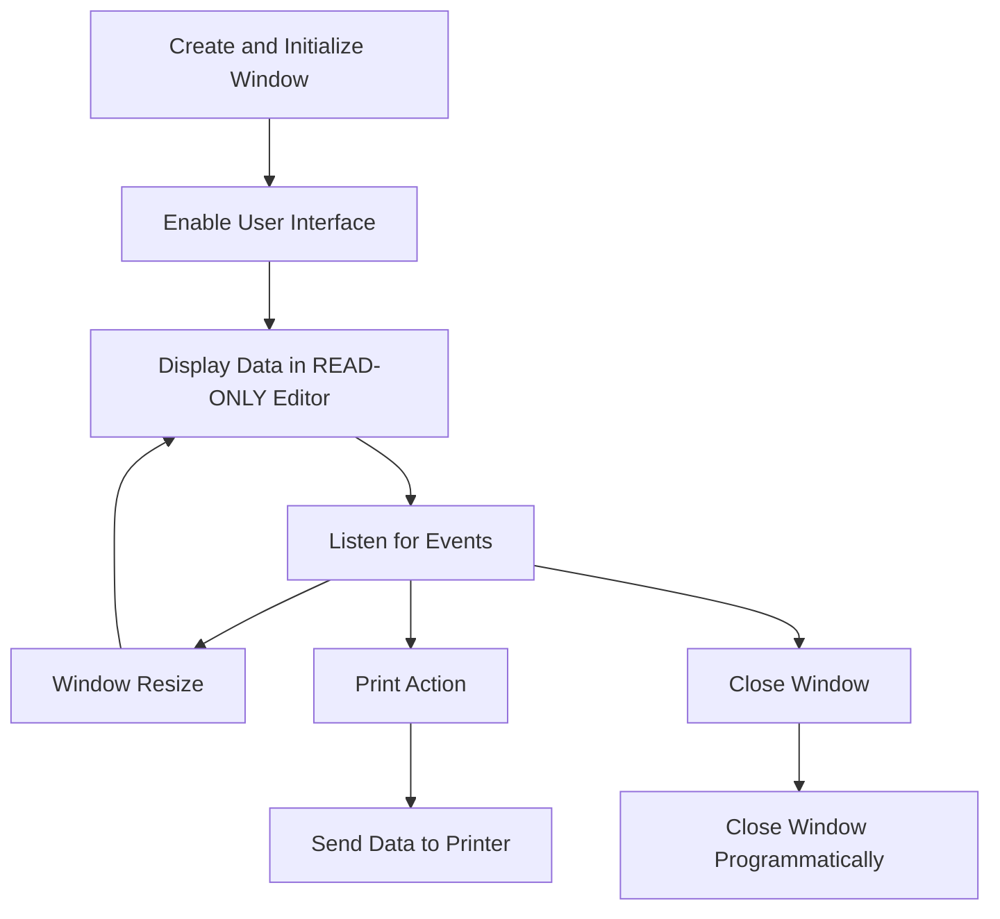

This document will cover the topic of the <SwmToken path="query-data.w" pos="7:4:6" line-data="  Name: query-data.w">`query-data`</SwmToken> window, which includes:

1. What the Window Does
2. Window Flow
3. File breakdown

## What the Window Does

The <SwmToken path="query-data.w" pos="7:4:6" line-data="  Name: query-data.w">`query-data`</SwmToken> window is designed to display data from the <SwmPath>[query-tester.w](query-tester.w)</SwmPath> window. It allows users to view and interact with the data in a <SwmToken path="query-data.w" pos="130:3:5" line-data="       edQuery:READ-ONLY IN FRAME DEFAULT-FRAME        = TRUE.">`READ-ONLY`</SwmToken> format. The window is created using the Progress <SwmToken path="query-data.w" pos="122:10:10" line-data="/* ***********  Runtime Attributes and AppBuilder Settings  *********** */">`AppBuilder`</SwmToken> and includes an editor widget for displaying the data string passed as a parameter.

## Window Flow

The high-level flow of the <SwmToken path="query-data.w" pos="7:4:6" line-data="  Name: query-data.w">`query-data`</SwmToken> window is as follows:

1. The window is created and initialized with the provided title and data string.
2. The user interface is enabled, displaying the data in a <SwmToken path="query-data.w" pos="130:3:5" line-data="       edQuery:READ-ONLY IN FRAME DEFAULT-FRAME        = TRUE.">`READ-ONLY`</SwmToken> editor widget.
3. The window listens for specific events such as window resize, close, and print actions.
4. When the window is resized, the editor widget is adjusted accordingly.
5. If the print action is triggered, the data is sent to the printer.
6. The window can be closed either by user action or programmatically.



The flowchart above illustrates the high-level flow of the <SwmToken path="query-data.w" pos="7:4:6" line-data="  Name: query-data.w">`query-data`</SwmToken> window.

<SwmSnippet path="/query-data.w" line="35">

---

## File breakdown

First, the preprocessor definitions are set up, including the procedure type, database awareness, and frame name.

```c
/* ********************  Preprocessor Definitions  ******************** */

&Scoped-define PROCEDURE-TYPE Window
&Scoped-define DB-AWARE no

/* Name of designated FRAME-NAME and/or first browse and/or first query */
&Scoped-define FRAME-NAME DEFAULT-FRAME

/* Standard List Definitions                                            */
&Scoped-Define ENABLED-OBJECTS edQuery
&Scoped-Define DISPLAYED-OBJECTS edQuery

/* Custom List Definitions                                              */
/* List-1,List-2,List-3,List-4,List-5,List-6                            */

/* _UIB-PREPROCESSOR-BLOCK-END */
```

---

</SwmSnippet>

<SwmSnippet path="/query-data.w" line="55">

---

Next, the control definitions are established, including the window handle, menu bar, and editor widget for displaying the data.

```c
/* ***********************  Control Definitions  ********************** */

/* Define the widget handle for the window                              */
DEFINE VAR C-Win AS WIDGET-HANDLE NO-UNDO.

/* Menu Definitions                                                     */
DEFINE MENU MENU-BAR-C-Win MENUBAR
       MENU-ITEM m_Print        LABEL "Print":U         .


/* Definitions of the field level widgets                               */
DEFINE VARIABLE edQuery AS CHARACTER
     VIEW-AS EDITOR SCROLLBAR-VERTICAL
     SIZE 94 BY 20.71
     BGCOLOR 15  NO-UNDO.


/* ************************  Frame Definitions  *********************** */

DEFINE FRAME DEFAULT-FRAME
     edQuery AT ROW 1 COL 1 NO-LABEL
```

---

</SwmSnippet>

<SwmSnippet path="/query-data.w" line="92">

---

Then, the window is created with specific attributes such as title, size, and visibility settings.

```c
/* *************************  Create Window  ************************** */

&ANALYZE-SUSPEND _CREATE-WINDOW
IF SESSION:DISPLAY-TYPE = "GUI":U THEN
  CREATE WINDOW C-Win ASSIGN
         HIDDEN             = YES
         TITLE              = "<insert window title>"
         HEIGHT             = 20.91
         WIDTH              = 94.6
         MAX-HEIGHT         = 320
         MAX-WIDTH          = 320
         VIRTUAL-HEIGHT     = 320
         VIRTUAL-WIDTH      = 320
         RESIZE             = YES
         SCROLL-BARS        = NO
         STATUS-AREA        = NO
         BGCOLOR            = ?
         FGCOLOR            = ?
         KEEP-FRAME-Z-ORDER = YES
         THREE-D            = YES
         MESSAGE-AREA       = NO
```

---

</SwmSnippet>

<SwmSnippet path="/query-data.w" line="122">

---

Going into runtime attributes, the editor widget is set to <SwmToken path="query-data.w" pos="130:3:5" line-data="       edQuery:READ-ONLY IN FRAME DEFAULT-FRAME        = TRUE.">`READ-ONLY`</SwmToken>, and the window is made visible if it is a valid handle.

```c
/* ***********  Runtime Attributes and AppBuilder Settings  *********** */

&ANALYZE-SUSPEND _RUN-TIME-ATTRIBUTES
/* SETTINGS FOR WINDOW C-Win
  VISIBLE,,RUN-PERSISTENT                                               */
/* SETTINGS FOR FRAME DEFAULT-FRAME
   FRAME-NAME                                                           */
ASSIGN
       edQuery:READ-ONLY IN FRAME DEFAULT-FRAME        = TRUE.

IF SESSION:DISPLAY-TYPE = "GUI":U AND VALID-HANDLE(C-Win)
THEN C-Win:HIDDEN = NO.

```

---

</SwmSnippet>

<SwmSnippet path="/query-data.w" line="142">

---

The control triggers are defined, including handling the <SwmToken path="query-data.w" pos="146:2:4" line-data="ON END-ERROR OF C-Win /* &lt;insert window title&gt; */">`END-ERROR`</SwmToken> event to ignore the 'Esc' key press in a persistently run window.

```c
/* ************************  Control Triggers  ************************ */

&Scoped-define SELF-NAME C-Win
&ANALYZE-SUSPEND _UIB-CODE-BLOCK _CONTROL C-Win C-Win
ON END-ERROR OF C-Win /* <insert window title> */
OR ENDKEY OF {&WINDOW-NAME} ANYWHERE DO:
  /* This case occurs when the user presses the "Esc" key.
     In a persistently run window, just ignore this.  If we did not, the
     application would exit. */
  IF THIS-PROCEDURE:PERSISTENT THEN RETURN NO-APPLY.
END.
```

---

</SwmSnippet>

<SwmSnippet path="/query-data.w" line="158">

---

The <SwmToken path="query-data.w" pos="159:2:4" line-data="ON WINDOW-CLOSE OF C-Win /* &lt;insert window title&gt; */">`WINDOW-CLOSE`</SwmToken> event is handled to close the window and terminate the procedure.

```c
&ANALYZE-SUSPEND _UIB-CODE-BLOCK _CONTROL C-Win C-Win
ON WINDOW-CLOSE OF C-Win /* <insert window title> */
DO:
  /* This event will close the window and terminate the procedure.  */
  APPLY "CLOSE":U TO THIS-PROCEDURE.
  RETURN NO-APPLY.
END.
```

---

</SwmSnippet>

<SwmSnippet path="/query-data.w" line="170">

---

The <SwmToken path="query-data.w" pos="171:2:4" line-data="ON WINDOW-RESIZED OF C-Win /* &lt;insert window title&gt; */">`WINDOW-RESIZED`</SwmToken> event adjusts the size of the editor widget based on the new window dimensions.

```c
&ANALYZE-SUSPEND _UIB-CODE-BLOCK _CONTROL C-Win C-Win
ON WINDOW-RESIZED OF C-Win /* <insert window title> */
DO:
  DEFINE VARIABLE iNewFrameWidth  AS INTEGER    NO-UNDO.
  DEFINE VARIABLE iNewFrameHeight AS INTEGER    NO-UNDO.

  DO WITH FRAME {&FRAME-NAME}:
    ASSIGN iNewFrameWidth  = SELF:WIDTH-PIXELS - 2
           iNewFrameHeight = SELF:HEIGHT-PIXELS - 2
           .

    IF iNewFrameWidth  GT FRAME {&FRAME-NAME}:WIDTH-PIXELS
    THEN ASSIGN FRAME {&FRAME-NAME}:WIDTH-PIXELS = iNewFrameWidth.

    IF iNewFrameHeight GT FRAME {&FRAME-NAME}:HEIGHT-PIXELS
    THEN ASSIGN FRAME {&FRAME-NAME}:HEIGHT-PIXELS = iNewFrameHeight.

    ASSIGN

      edQuery:X                = 1
      edQuery:Y                = 1
```

---

</SwmSnippet>

<SwmSnippet path="/query-data.w" line="202">

---

The print action is handled by running the <SwmToken path="query-data.w" pos="206:3:5" line-data="  RUN print-editor.">`print-editor`</SwmToken> procedure.

```c
&Scoped-define SELF-NAME m_Print
&ANALYZE-SUSPEND _UIB-CODE-BLOCK _CONTROL m_Print C-Win
ON CHOOSE OF MENU-ITEM m_Print /* Print */
DO:
  RUN print-editor.
END.
```

---

</SwmSnippet>

<SwmSnippet path="/query-data.w" line="215">

---

The main block sets the current window, enables the user interface, and waits for the exit condition.

```c
&ANALYZE-SUSPEND _UIB-CODE-BLOCK _CUSTOM _MAIN-BLOCK C-Win


/* ***************************  Main Block  *************************** */

/* Set CURRENT-WINDOW: this will parent dialog-boxes and frames.        */
ASSIGN CURRENT-WINDOW                = {&WINDOW-NAME}
       THIS-PROCEDURE:CURRENT-WINDOW = {&WINDOW-NAME}.

/* The CLOSE event can be used from inside or outside the procedure to  */
/* terminate it.                                                        */
ON CLOSE OF THIS-PROCEDURE
   RUN disable_UI.

/* Best default for GUI applications is...                              */
PAUSE 0 BEFORE-HIDE.

/* Now enable the interface and wait for the exit condition.            */
/* (NOTE: handle ERROR and END-KEY so cleanup code will always fire.    */
MAIN-BLOCK:
DO ON ERROR   UNDO MAIN-BLOCK, LEAVE MAIN-BLOCK
```

---

</SwmSnippet>

<SwmSnippet path="/query-data.w" line="256">

---

The <SwmToken path="query-data.w" pos="257:13:13" line-data="&amp;ANALYZE-SUSPEND _UIB-CODE-BLOCK _PROCEDURE disable_UI C-Win  _DEFAULT-DISABLE">`disable_UI`</SwmToken> procedure cleans up the user interface by deleting dynamic widgets and hiding frames.

```c

&ANALYZE-SUSPEND _UIB-CODE-BLOCK _PROCEDURE disable_UI C-Win  _DEFAULT-DISABLE
PROCEDURE disable_UI :
/*------------------------------------------------------------------------------
  Purpose:     DISABLE the User Interface
  Parameters:  <none>
  Notes:       Here we clean-up the user-interface by deleting
               dynamic widgets we have created and/or hide
               frames.  This procedure is usually called when
               we are ready to "clean-up" after running.
------------------------------------------------------------------------------*/
  /* Delete the WINDOW we created */
  IF SESSION:DISPLAY-TYPE = "GUI":U AND VALID-HANDLE(C-Win)
  THEN DELETE WIDGET C-Win.
  IF THIS-PROCEDURE:PERSISTENT THEN DELETE PROCEDURE THIS-PROCEDURE.
END PROCEDURE.
```

---

</SwmSnippet>

<SwmSnippet path="/query-data.w" line="276">

---

The <SwmToken path="query-data.w" pos="276:13:13" line-data="&amp;ANALYZE-SUSPEND _UIB-CODE-BLOCK _PROCEDURE enable_UI C-Win  _DEFAULT-ENABLE">`enable_UI`</SwmToken> procedure displays and enables the widgets in the user interface and opens all queries associated with each frame and browse.

```c
&ANALYZE-SUSPEND _UIB-CODE-BLOCK _PROCEDURE enable_UI C-Win  _DEFAULT-ENABLE
PROCEDURE enable_UI :
/*------------------------------------------------------------------------------
  Purpose:     ENABLE the User Interface
  Parameters:  <none>
  Notes:       Here we display/view/enable the widgets in the
               user-interface.  In addition, OPEN all queries
               associated with each FRAME and BROWSE.
               These statements here are based on the "Other
               Settings" section of the widget Property Sheets.
------------------------------------------------------------------------------*/
  DISPLAY edQuery
      WITH FRAME DEFAULT-FRAME IN WINDOW C-Win.
  ENABLE edQuery
      WITH FRAME DEFAULT-FRAME IN WINDOW C-Win.
  {&OPEN-BROWSERS-IN-QUERY-DEFAULT-FRAME}
  VIEW C-Win.
END PROCEDURE.
```

---

</SwmSnippet>

<SwmSnippet path="/query-data.w" line="298">

---

The <SwmToken path="query-data.w" pos="298:13:15" line-data="&amp;ANALYZE-SUSPEND _UIB-CODE-BLOCK _PROCEDURE initialize-window C-Win">`initialize-window`</SwmToken> procedure assigns the window title and sets the editor widget's screen value to the provided data string.

```c
&ANALYZE-SUSPEND _UIB-CODE-BLOCK _PROCEDURE initialize-window C-Win
PROCEDURE initialize-window :
/*------------------------------------------------------------------------------
  Purpose:
  Parameters:  <none>
  Notes:
------------------------------------------------------------------------------*/

ASSIGN
  {&WINDOW-NAME}:TITLE = pcTitle
   edQuery:SCREEN-VALUE IN FRAME {&FRAME-NAME} = pcDataString.

END PROCEDURE.
```

---

</SwmSnippet>

<SwmSnippet path="/query-data.w" line="315">

---

The <SwmToken path="query-data.w" pos="315:13:13" line-data="&amp;ANALYZE-SUSPEND _UIB-CODE-BLOCK _PROCEDURE killquerywindow C-Win">`killquerywindow`</SwmToken> procedure closes the window programmatically.

```c
&ANALYZE-SUSPEND _UIB-CODE-BLOCK _PROCEDURE killquerywindow C-Win
PROCEDURE killquerywindow :
/* Close it
  */
  APPLY "close":U TO THIS-PROCEDURE.
END PROCEDURE.
```

---

</SwmSnippet>

<SwmSnippet path="/query-data.w" line="325">

---

The <SwmToken path="query-data.w" pos="325:13:15" line-data="&amp;ANALYZE-SUSPEND _UIB-CODE-BLOCK _PROCEDURE print-editor C-Win">`print-editor`</SwmToken> procedure outputs the data string to the printer.

```c
&ANALYZE-SUSPEND _UIB-CODE-BLOCK _PROCEDURE print-editor C-Win
PROCEDURE print-editor :
/* Output to printer
  */
  DEFINE VARIABLE liLine AS INTEGER NO-UNDO.
  DEFINE VARIABLE liNumLines AS INTEGER NO-UNDO.

  DO WITH FRAME {&FRAME-NAME}:
    ASSIGN liNumLines = NUM-ENTRIES(pcDataString,"~n").
    OUTPUT TO PRINTER PAGED.
    DO liLine = 1 TO liNumLines:
    PUT UNFORMATTED ENTRY(liLine,pcDataString,"~n") SKIP.
    END.
    OUTPUT CLOSE.
  END.

END PROCEDURE.
```

---

</SwmSnippet>

&nbsp;

*This is an auto-generated document by Swimm 🌊 and has not yet been verified by a human*

<SwmMeta version="3.0.0" repo-id="Z2l0aHViJTNBJTNBRGF0YURpZ2dlciUzQSUzQVBBUFA5Mg==" repo-name="DataDigger"><sup>Powered by [Swimm](/)</sup></SwmMeta>
