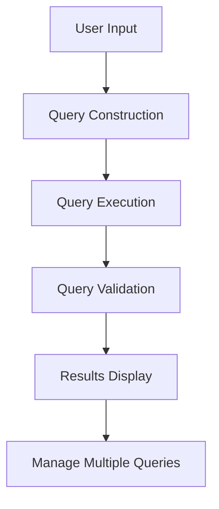

# What is Query Functionality

Query functionality allows users to interact with the database by retrieving specific data based on user-defined criteria. This is achieved through a user interface that provides various widgets and controls for inputting and modifying query criteria.

# Query Interface

The query interface includes buttons, text fields, and other elements that enable users to construct and execute queries. The system supports multiple queries, allowing users to manage and switch between different sets of criteria.

<SwmSnippet path="/dQueries.w" line="17">

---

The <SwmPath>[dQueries.w](dQueries.w)</SwmPath> file defines input parameters for the database, table, and current query, as well as an output parameter for the query number. This structure is essential for managing the query dialog box.

```c
DEFINE INPUT PARAMETER  pcDatabase     AS CHARACTER NO-UNDO.
DEFINE INPUT PARAMETER  pcTable        AS CHARACTER NO-UNDO.
DEFINE INPUT PARAMETER  pcCurrentQuery AS CHARACTER NO-UNDO.
DEFINE OUTPUT PARAMETER piQueryNr      AS INTEGER NO-UNDO INITIAL ?.
```

---

</SwmSnippet>

# Query Testing

Queries can be tested and validated using the provided tools to ensure they return the expected results. The <SwmPath>[query-tester.w](query-tester.w)</SwmPath> file sets up a temporary table and a query for testing purposes.

<SwmSnippet path="/query-tester.w" line="19">

---

The <SwmPath>[query-tester.w](query-tester.w)</SwmPath> file defines a temporary table for storing test queries and includes various local variables and handles for managing the query testing interface. It also defines control triggers for handling user interactions with the query tester.

```c
DEFINE INPUT-OUTPUT PARAMETER TABLE FOR ttTestQuery.

/* Local Variable Definitions ---                                       */

DEFINE TEMP-TABLE ttBuffer NO-UNDO
  FIELD hBuffer    AS HANDLE
  FIELD cDatabase  AS CHARACTER
  FIELD cTableName AS CHARACTER
  INDEX iPrimary cDatabase cTableName.

&SCOPED-DEFINE CleanUp DELETE OBJECT hQry NO-ERROR. ~~n~
                       RUN clean-temp-table IN THIS-PROCEDURE.

DEFINE VARIABLE lErrorDetected AS LOGICAL NO-UNDO.
DEFINE VARIABLE h-browser      AS HANDLE  NO-UNDO.
DEFINE VARIABLE h-ProgName     AS HANDLE  NO-UNDO.
DEFINE VARIABLE h-QueryName    AS HANDLE  NO-UNDO.
DEFINE VARIABLE h-SeqName      AS HANDLE  NO-UNDO.
DEFINE QUERY q1 FOR ttTestQuery SCROLLING.
```

---

</SwmSnippet>



# Main Functions

There are several main functions related to query functionality, including <SwmPath>[dQueries.w](dQueries.w)</SwmPath> and <SwmPath>[query-tester.w](query-tester.w)</SwmPath>. These files define the structure and behavior of the query dialog box and the query testing interface, respectively.

&nbsp;

*This is an auto-generated document by Swimm 🌊 and has not yet been verified by a human*

<SwmMeta version="3.0.0" repo-id="Z2l0aHViJTNBJTNBRGF0YURpZ2dlciUzQSUzQVBBUFA5Mg==" repo-name="DataDigger"><sup>Powered by [Swimm](/)</sup></SwmMeta>
