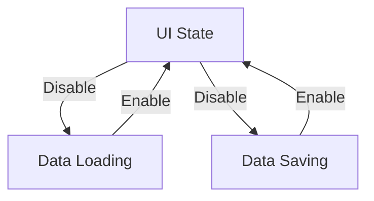

# User Interface Overview

The User Interface (UI) is the part of the application that users interact with directly. It includes all the visual elements, such as buttons, menus, and forms, that allow users to perform actions and view data.

## Enabling and Disabling the UI

The UI can be enabled or disabled depending on the application's state. This functionality is used to prevent user interactions during certain operations, ensuring data integrity and a smooth user experience. Disabling the UI typically occurs during processes that require uninterrupted execution, such as data loading or saving. Once these processes are complete, the UI is re-enabled, allowing users to continue their interactions.

## UI Components

The UI components are spread across various files, each responsible for different parts of the application. These components work together to provide a cohesive and interactive experience for the user.

<SwmSnippet path="/DatePicker.w" line="602">

---

The <SwmPath>[DatePicker.w](DatePicker.w)</SwmPath> file contains code to disable the UI to manage user interactions during specific operations. For example, the procedure <SwmToken path="DatePicker.w" pos="602:4:4" line-data="  Purpose:     DISABLE the User Interface">`DISABLE`</SwmToken> hides all frames to clean up the user interface.

```c
  Purpose:     DISABLE the User Interface
  Parameters:  <none>
  Notes:       Here we clean-up the user-interface by deleting
               dynamic widgets we have created and/or hide 
               frames.  This procedure is usually called when
               we are ready to "clean-up" after running.
------------------------------------------------------------------------------*/
  /* Hide all frames. */
  HIDE FRAME frCalendarDays.
END PROCEDURE.
```

---

</SwmSnippet>

<SwmSnippet path="/dQueries.w" line="567">

---

Similarly, the <SwmPath>[dQueries.w](dQueries.w)</SwmPath> file contains functionality to disable the UI, ensuring smooth execution of queries. The procedure <SwmToken path="dQueries.w" pos="567:4:4" line-data="  Purpose:     DISABLE the User Interface">`DISABLE`</SwmToken> hides all frames to clean up the user interface.

```c
  Purpose:     DISABLE the User Interface
  Parameters:  <none>
  Notes:       Here we clean-up the user-interface by deleting
               dynamic widgets we have created and/or hide 
               frames.  This procedure is usually called when
               we are ready to "clean-up" after running.
------------------------------------------------------------------------------*/
  /* Hide all frames. */
  HIDE FRAME Dialog-Frame.
END PROCEDURE.
```

---

</SwmSnippet>

<SwmSnippet path="/dNewGroup.w" line="195">

---

In the <SwmPath>[dNewGroup.w](dNewGroup.w)</SwmPath> file, the UI is disabled when a new group is being created to prevent any interruptions. The procedure <SwmToken path="dNewGroup.w" pos="195:4:4" line-data="  Purpose:     DISABLE the User Interface">`DISABLE`</SwmToken> hides all frames to clean up the user interface.

```c
  Purpose:     DISABLE the User Interface
  Parameters:  <none>
  Notes:       Here we clean-up the user-interface by deleting
               dynamic widgets we have created and/or hide 
               frames.  This procedure is usually called when
               we are ready to "clean-up" after running.
------------------------------------------------------------------------------*/
  /* Hide all frames. */
  HIDE FRAME Dialog-Frame.
END PROCEDURE.
```

---

</SwmSnippet>

<SwmSnippet path="/wConnections.w" line="990">

---

The <SwmPath>[wConnections.w](wConnections.w)</SwmPath> file also includes code to disable the UI, managing user interactions during connection operations. The procedure <SwmToken path="wConnections.w" pos="990:4:4" line-data="  Purpose:     DISABLE the User Interface">`DISABLE`</SwmToken> hides all frames to clean up the user interface.

```c
  Purpose:     DISABLE the User Interface
  Parameters:  <none>
  Notes:       Here we clean-up the user-interface by deleting
               dynamic widgets we have created and/or hide 
               frames.  This procedure is usually called when
               we are ready to "clean-up" after running.
------------------------------------------------------------------------------*/
  /* Hide all frames. */
  HIDE FRAME Dialog-Frame.
END PROCEDURE.
```

---

</SwmSnippet>



## Enabling the UI

Once the necessary operations are complete, the UI is re-enabled, allowing users to continue their interactions. This is typically done by calling an <SwmToken path="dQueries.w" pos="581:21:21" line-data="&amp;ANALYZE-SUSPEND _UIB-CODE-BLOCK _PROCEDURE enable_UI Dialog-Frame  _DEFAULT-ENABLE">`ENABLE`</SwmToken> procedure in the respective files.

<SwmSnippet path="/dQueries.w" line="581">

---

In the <SwmPath>[dQueries.w](dQueries.w)</SwmPath> file, the procedure <SwmToken path="dQueries.w" pos="581:21:21" line-data="&amp;ANALYZE-SUSPEND _UIB-CODE-BLOCK _PROCEDURE enable_UI Dialog-Frame  _DEFAULT-ENABLE">`ENABLE`</SwmToken> is used to re-enable the UI after the necessary operations are complete.

```c
&ANALYZE-SUSPEND _UIB-CODE-BLOCK _PROCEDURE enable_UI Dialog-Frame  _DEFAULT-ENABLE
PROCEDURE enable_UI :
/*------------------------------------------------------------------------------
  Purpose:     ENABLE the User Interface
```

---

</SwmSnippet>

&nbsp;

*This is an auto-generated document by Swimm 🌊 and has not yet been verified by a human*

<SwmMeta version="3.0.0" repo-id="Z2l0aHViJTNBJTNBRGF0YURpZ2dlciUzQSUzQVBBUFA5Mg==" repo-name="DataDigger"><sup>Powered by [Swimm](/)</sup></SwmMeta>
